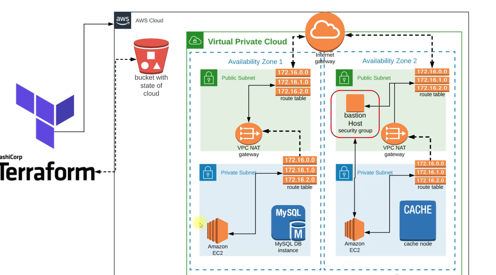

# Cloud State with Terraform

A comprehensive Terraform project for managing cloud infrastructure state across multiple cloud providers and environments.

## Overview

This project demonstrates best practices for managing cloud infrastructure state using Terraform, including state management, remote state storage, and multi-environment deployments.

## Scenario

This project addresses common cloud management challenges faced by teams that:

- **Cloud Management Team**: Dedicated teams responsible for infrastructure operations
- **Deploy, Setup & Manage Infrastructure on the Cloud**: Automated provisioning and management workflows
- **Heavy Usage of Cloud services**: High-scale infrastructure with multiple cloud providers
- **Regular Provisioning Requests & Changes**: Frequent infrastructure updates and modifications

The Terraform configuration provides solutions for these scenarios through automated state management, environment isolation, and scalable infrastructure patterns.

## Problems Addressed

This project solves common infrastructure management challenges:

### Infrastructure Complexity
- **Infra setup is complex process**: Manual infrastructure provisioning is error-prone and time-consuming
- **Not Repeatable**: Manual processes lack consistency across environments
- **Difficult to Track, Not Centralized**: No centralized view of infrastructure state and changes

### Manual Management Issues
- **Chances of Human Error**: Manual configuration leads to inconsistencies and mistakes
- **Managing Manually is time consuming task**: Repetitive manual tasks waste valuable time

### How Terraform Solves These Problems
- **Infrastructure as Code**: Define infrastructure in declarative configuration files
- **Repeatable Deployments**: Consistent, automated provisioning across environments
- **Centralized State Management**: Single source of truth for infrastructure state
- **Error Reduction**: Automated processes minimize human error
- **Time Efficiency**: Automated workflows reduce manual intervention

## Solution

This Terraform project provides comprehensive solutions for cloud infrastructure management:

### Core Solutions
- **Configuration Management of Infrastructure**: Define and manage infrastructure as code
- **Automatic Setup (NO Human Errors)**: Eliminate manual errors through automation
- **Maintain State of Infrastructure**: Track and manage infrastructure state centrally

### Key Benefits
- **Version Control [IAAC]**: Infrastructure as Code with full version control
- **Repeatable**: Consistent deployments across all environments
- **Reusable**: Modular components that can be shared and reused

### Implementation Features
- **Declarative Configuration**: Define desired state, let Terraform handle the rest
- **State Management**: Centralized state storage with locking and versioning
- **Multi-Environment Support**: Separate configurations for dev, staging, and production
- **Automated Workflows**: CI/CD integration for seamless deployments

## Business Impact

Cloud automation delivers significant business value:

### Key Statistics
- **71%** of organizations achieve **10% Revenue Growth** through automation
- **84%** report **Increased Revenue and Lowered Operations Cost**
- **81%** become **More Innovative** with automated infrastructure
- **84%** achieve **More Agile** operations and faster time-to-market

### Benefits for Your Organization
- **Cost Reduction**: Automated provisioning reduces manual effort and errors
- **Faster Delivery**: Infrastructure as Code accelerates deployment cycles
- **Improved Reliability**: Consistent, repeatable deployments
- **Enhanced Security**: Automated security controls and compliance

## Tools and Cloud Platform

This project leverages the industry-leading combination of:

### Terraform
- **Configuration Management**: Infrastructure as Code for AWS infrastructure
- **Multi-Cloud Support**: Extensible to other cloud providers
- **State Management**: Centralized state tracking and versioning
- **Modular Design**: Reusable components and modules

### AWS Cloud Platform
- **Complete Infrastructure Setup**: Comprehensive cloud services
- **Maintain Infrastructure**: Automated scaling and management
- **Enterprise-Grade Security**: Built-in security and compliance features
- **Global Reach**: Worldwide infrastructure deployment

### Integration Benefits
- **Seamless Workflow**: Terraform manages AWS resources efficiently
- **Best Practices**: Industry-standard infrastructure patterns
- **Scalability**: Handle growing infrastructure demands
- **Cost Optimization**: Automated resource management

## Features

- **Multi-Cloud Support**: Configure and manage resources across AWS, Azure, and Google Cloud Platform
- **State Management**: Remote state storage with locking and versioning
- **Environment Separation**: Separate configurations for development, staging, and production
- **Modular Design**: Reusable Terraform modules for common infrastructure components
- **Security Best Practices**: Secure state storage and access controls
- **CI/CD Integration**: Ready for integration with CI/CD pipelines

## Architecture Overview



This diagram illustrates the complete infrastructure architecture managed by this Terraform project, showing the relationship between different AWS services and components.

### Architecture Components

#### Terraform State Management (Left Side)
- **HashiCorp Terraform**: Infrastructure as Code tool for provisioning and managing AWS resources
- **AWS Cloud**: Amazon Web Services platform hosting the infrastructure
- **Remote State Storage**: S3 bucket containing the state of cloud infrastructure with state tracking

#### AWS Cloud Architecture - Virtual Private Cloud (Right Side)

##### Network Infrastructure
- **Virtual Private Cloud (VPC)**: Isolated network environment with green dashed boundary
- **Internet Gateway**: Entry and exit point for internet traffic at the top of VPC
- **Route Tables**: Network routing configuration with IP ranges (172.16.0.0, 172.16.1.0, 172.16.2.0)

##### Multi-Availability Zone Deployment (High Availability)

**Availability Zone 1 (Left Half of VPC):**
- **Public Subnet**: Internet-facing resources with direct internet access
  - **VPC NAT Gateway**: Network Address Translation for outbound internet access
- **Private Subnet**: Internal resources with enhanced security
  - **Amazon EC2**: Application server instance
  - **MySQL DB Instance**: Relational database (Amazon RDS) connected to EC2

**Availability Zone 2 (Right Half of VPC):**
- **Public Subnet**: Internet-facing resources
  - **Bastion Host Security Group**: Secure jump server for administrative access
  - **VPC NAT Gateway**: Network Address Translation for outbound access
- **Private Subnet**: Internal resources
  - **Amazon EC2**: Application server instance
  - **Cache Node**: In-memory caching service (Amazon ElastiCache) connected to EC2

#### Connectivity and Data Flow
1. **Internet Access**: Internet Gateway → Public Subnets → VPC NAT Gateways → Private Subnets
2. **Application Processing**: EC2 instances in private subnets process application requests
3. **Backend Services**: EC2 instances connect to MySQL DB (AZ1) and Cache Node (AZ2)
4. **Administrative Access**: Bastion Host Security Group provides secure access to private subnets
5. **State Management**: Terraform manages all infrastructure state via S3 bucket

#### Security Architecture
- **Multi-AZ Deployment**: High availability across availability zones
- **Private Subnets**: Internal resources isolated from internet
- **NAT Gateways**: Secure outbound internet access for private resources
- **Bastion Host**: Secure administrative access to private network
- **Security Groups**: Network-level firewall rules and access controls

### Security Architecture
- **Multi-AZ Deployment**: High availability across availability zones
- **Encryption**: Data encryption at rest and in transit
- **Private Subnets**: Internal resources isolated from internet
- **Security Groups**: Granular network access controls
- **IAM Roles**: Least privilege access principles

## Project Structure

```
cloud-state-terraform/
├── Diagram/
│   ├── architecture.png
│   └── arch2.png
├── templates/
│   └── db-deploy.tmpl
├── backend-s3.tf
├── backend-services.tf
├── bastion-host.tf
├── bean-app.tf
├── bean-env.tf
├── keypairs.tf
├── providers.tf
├── secgrp.tf
├── vars.tf
├── vpc.tf
├── vprofilekey
├── vprofilekey.pub
└── README.md
```

## Prerequisites

- Terraform >= 1.0
- AWS CLI (for AWS resources)
- Azure CLI (for Azure resources)
- Google Cloud SDK (for GCP resources)

## Implementation Details

This project implements a complete vprofile application infrastructure using Terraform:

### Core Configuration Files

#### **`backend-s3.tf`** - Remote State Management
```hcl
terraform {
  backend "s3" {
    bucket = "your-terraform-state-bucket"
    key    = "terraform/backend"
    region = "us-east-2"
  }
}
```
- **S3 Bucket**: Configure your own S3 bucket for centralized state storage
- **State Locking**: Prevents concurrent modifications
- **Versioning**: Tracks infrastructure changes over time

#### **`vpc.tf`** - Network Infrastructure
- **VPC Module**: Uses terraform-aws-modules/vpc/aws
- **CIDR Block**: 172.21.0.0/16
- **Multi-AZ**: 3 Availability Zones (us-east-2a, us-east-2b, us-east-2c)
- **Subnets**: 3 Public + 3 Private subnets
- **NAT Gateway**: Single NAT for cost optimization
- **DNS Support**: Enabled for internal resolution

#### **`secgrp.tf`** - Security Groups
- **ELB Security Group**: Load balancer access (port 80)
- **Bastion Security Group**: SSH access from specific IP
- **Production Security Group**: Application instances
- **Backend Security Group**: RDS, ElastiCache, MQ services
- **Cross-Service Communication**: Internal security group rules

#### **`backend-services.tf`** - Data Layer
- **RDS MySQL**: 
  - Engine: MySQL 5.6.34
  - Instance: db.t2.micro
  - Database: Configure your database name
  - Multi-AZ: false (single instance)
- **ElastiCache Memcached**:
  - Engine: Memcached 1.5
  - Instance: cache.t2.micro
  - Port: 11211
- **Amazon MQ ActiveMQ**:
  - Engine: ActiveMQ 5.15.0
  - Instance: mq.t2.micro
  - Authentication: Configure username/password

#### **`bean-env.tf`** - Application Layer
- **Elastic Beanstalk**: Tomcat 8.5 Corretto 11
- **Auto Scaling**: 1-8 instances
- **Load Balancer**: Cross-zone enabled
- **Deployment**: Rolling update strategy
- **Security**: Private subnets with bastion access

#### **`bastion-host.tf`** - Administrative Access
- **EC2 Instance**: t2.micro in public subnet
- **Database Deployment**: Automated script execution
- **Git Integration**: Clones your application repository
- **Database Initialization**: Runs SQL backup script

### Infrastructure Components

#### **Network Architecture**
- **VPC**: 172.21.0.0/16 with 6 subnets
- **Public Subnets**: 172.21.1.0/24, 172.21.2.0/24, 172.21.3.0/24
- **Private Subnets**: 172.21.4.0/24, 172.21.5.0/24, 172.21.6.0/24
- **NAT Gateway**: Single gateway for cost efficiency
- **Internet Gateway**: Public internet access

#### **Application Stack**
- **Platform**: AWS Elastic Beanstalk
- **Runtime**: Tomcat 8.5 with Corretto 11
- **Scaling**: Auto-scaling group (1-8 instances)
- **Load Balancing**: Application Load Balancer
- **Deployment**: Rolling updates with health checks

#### **Backend Services**
- **Database**: RDS MySQL for persistent data
- **Caching**: ElastiCache Memcached for performance
- **Messaging**: Amazon MQ ActiveMQ for async processing
- **Storage**: All services in private subnets

#### **Security Implementation**
- **Bastion Host**: Secure jump server in public subnet
- **Security Groups**: Granular access controls
- **Private Subnets**: Backend services isolated
- **SSH Keys**: Key-based authentication
- **Database Access**: Restricted to application instances

### Automation Features

#### **Database Deployment**
- **Template**: `templates/db-deploy.tmpl`
- **Git Integration**: Clones your application repository
- **Database Setup**: Automated SQL script execution
- **Bastion Execution**: Remote script deployment

#### **State Management**
- **Remote Backend**: S3 bucket for state storage
- **State Locking**: Prevents concurrent modifications
- **Version Control**: Infrastructure as Code
- **Collaboration**: Team-safe state management

### Configuration Variables

#### **Network Configuration**
- **Region**: us-east-2
- **VPC CIDR**: 172.21.0.0/16
- **Availability Zones**: us-east-2a, us-east-2b, us-east-2c
- **Instance Types**: t2.micro for cost optimization

#### **Application Configuration**
- **Database**: MySQL with your database name
- **Caching**: Memcached for session management
- **Messaging**: ActiveMQ for asynchronous processing
- **Scaling**: 1-8 instances based on demand

## Quick Start

1. **Clone the repository**
   ```bash
   git clone <repository-url>
   cd cloud-state-terraform
   ```

2. **Initialize Terraform**
   ```bash
   terraform init
   ```

3. **Configure your environment**
   ```bash
   cp environments/dev/terraform.tfvars.example environments/dev/terraform.tfvars
   # Edit the variables file with your configuration
   ```

4. **Plan and Apply**
   ```bash
   terraform plan
   terraform apply
   ```

## State Management

This project uses remote state storage to ensure:
- **Collaboration**: Multiple team members can work safely
- **State Locking**: Prevents concurrent modifications
- **Versioning**: Track changes to infrastructure state
- **Security**: Encrypted state storage

### Current S3 Backend Status
- **Bucket Name**: Configure your own S3 bucket name
- **Region**: US East (Ohio) - us-east-2
- **Status**: Ready for Terraform state files
- **Configuration**: Matches backend-s3.tf configuration
- **State**: Currently empty, awaiting first `terraform apply`

### Backend Configuration

```hcl
terraform {
  backend "s3" {
    bucket = "your-terraform-state-bucket"
    key    = "terraform/backend"
    region = "us-east-2"
  }
}
```

## Environment Management

### Development
- Lightweight resources for testing
- Cost-optimized configurations
- Quick deployment cycles

### Staging
- Production-like environment
- Integration testing
- Performance validation

### Production
- High availability configurations
- Security hardening
- Monitoring and alerting

## Modules

### Networking Module
- VPC/VNet configuration
- Subnet management
- Security groups and firewalls
- Load balancers

### Compute Module
- Virtual machines and instances
- Auto-scaling groups
- Container orchestration
- Serverless functions

### Storage Module
- Object storage buckets
- Block storage volumes
- Database instances
- Backup and recovery

## Security Considerations

- **State Encryption**: All state files are encrypted at rest
- **Access Controls**: IAM roles and policies for state access
- **Secrets Management**: Integration with HashiCorp Vault
- **Network Security**: Private subnets and security groups

## Best Practices

1. **State Isolation**: Separate state files for different environments
2. **Variable Management**: Use `.tfvars` files for environment-specific values
3. **Module Versioning**: Pin module versions for stability
4. **Documentation**: Keep README files updated with changes
5. **Testing**: Use `terraform plan` before applying changes

## Conclusion

This Cloud State with Terraform project demonstrates a production-ready approach to infrastructure management using Infrastructure as Code principles. By implementing this solution, organizations can achieve:

### **Operational Excellence**
- **Automated Infrastructure**: Eliminate manual provisioning errors and reduce deployment time
- **Consistent Environments**: Repeatable deployments across development, staging, and production
- **Centralized State Management**: Single source of truth for all infrastructure components
- **Team Collaboration**: Safe concurrent development with state locking

### **Business Value**
- **Cost Optimization**: Automated resource management and scaling
- **Faster Time-to-Market**: Rapid infrastructure provisioning and updates
- **Improved Reliability**: High availability with multi-AZ deployment
- **Enhanced Security**: Comprehensive security groups and private network architecture

### **Technical Benefits**
- **Scalability**: Auto-scaling groups handle variable load demands
- **Maintainability**: Modular Terraform code with clear separation of concerns
- **Monitoring**: Integrated health checks and application monitoring
- **Disaster Recovery**: Multi-AZ deployment with automated failover capabilities

### **Next Steps**
1. **Deploy Infrastructure**: Run `terraform init` and `terraform apply` to provision the complete stack
2. **Monitor Performance**: Set up CloudWatch monitoring and alerting
3. **Scale as Needed**: Adjust auto-scaling parameters based on application demands
4. **Continuous Improvement**: Iterate on the infrastructure based on usage patterns

This project serves as a foundation for modern cloud infrastructure management, providing the tools and patterns needed to build, deploy, and maintain scalable applications in the cloud.

---